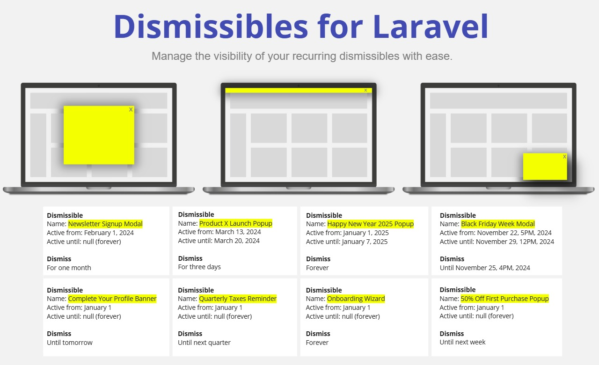

# 📣 Dismissibles for Laravel



A Laravel package for easily managing the visibility of your recurring, dismissible objects like popups/notifications/modals on the backend. This package does not include frontend components, so it's compatible with any frontend you can use.

## 📕 Table of Contents

- [✅ What problem does this solve?](#-what-problem-does-this-solve)
- [📦 Installation](#-installation)
- [❓ How to use](#-how-to-use)
- [❗ Good to know](#-good-to-know)
- [💾 Database tables](#-database-tables)
- [☕ Buy me a coffee](#-buy-me-a-coffee)

## ✅ What problem does this solve?
Say you have a popup you want to show to every user, daily for a week. Users can dismiss it and it should not show up again for the rest of the day until the next day.

This packages handles the complex logic regarding whether the (dismissible) popup should be visible to the current user at the current moment. It basically handles the visibility of your dismissible. It's highly customizable, making it very flexible for many scenario's.

Because it's serverside we can easily get statistics like who dismissed what, when and where.

## 📦 Installation
1. Require the package in your Laravel application
```shell
composer require rellix/dismissibles-for-laravel
```

2. Run the migrations to create the database tables
```shell
php artisan migrate
```

## ❓ How to use

### 1. Add the interface and trait to any model
```php
use Rellix\Dismissibles\Contracts\Dismisser;
use Rellix\Dismissibles\Traits\HasDismissibles;

class User implements Dismisser
{
    use HasDismissibles;
    ...
}

```

### 2. Create a dismissible (migration)
```php
use Illuminate\Support\Facades\Date;
use Illuminate\Support\Facades\DB;
...

return new class () extends Migration {
    public function up(): void
    {
        DB::table('dismissibles')->insert([
            'name'         => 'Test Popup', // This is your **unique** identifier
            'active_from'  => Date::createFromFormat('d-m-Y', '01-03-2024'),
            'active_until' => null, // Optional end date
            'created_at'   => Date::now(),
            'updated_at'   => Date::now(),
        ]);
    }
    
    ...
};
```

and run your created migration:
```php
php artisan migrate
```

<details>

<summary>Click here to view how you can create/fetch a Dismissible inline using the "active"-scope and "firstOrCreate".</summary>

```php
Dismissible::active()->firstOrCreate(
    ['name' => 'Test Popup'], 
    [
        'active_from'  => Date::createFromFormat('d-m-Y', '01-03-2024'),
        'active_until' => null,
        'created_at'   => Date::now(),
        'updated_at'   => Date::now(),
    ]
);
```

</details>

### 3. Check whether it should be visible at the current moment
```php
use Rellix\Dismissibles\Facades\Dismissibles;

class SomeController {
    public function index()
    {
        ...
    
        // It's recommended to centralize dismissible names in an enum (or config)
        $showPopup = Dismissibles::shouldBeVisible('Test Popup', $user);
        
        // Here are some more examples, including ones with additional conditionals:
        $showPopup = Dismissibles::shouldBeVisible('Happy New Year 2025 Popup', $user);
        $showPopup = !$user->is_subscribed && Dismissibles::shouldBeVisible('Newsletter signup modal', $user);
        $showPopup = !$user->has_completed_profile && Dismissibles::shouldBeVisible('Complete your profile notification', $user);
        $showPopup = !$user->has_orders && Dismissibles::shouldBeVisible('50% Off First Purchase Popup', $user);
        
        ...
        
        // You can also get all Dismissibles that should be visible. Useful for performance reasons.
        $dismissibles = Dismissibles::getAllFor($user);
        
        ...
    }
}
```

### 4. Dismiss it for a specified period
```php
use Rellix\Dismissibles\Facades\Dismissibles;

class SomeController {
    public function dismiss()
    {
        ...
        
        Dismissibles::dismiss('Test Popup', $user)->untilNextWeek();
        
        // Here's an overview of all the ways you can dismiss:
        Dismissibles::dismiss('Test Popup', $user)
            ->untilTomorrow();
            ->untilNextWeek();
            ->untilNextMonth();
            ->untilNextQuarter();
            ->untilNextYear();
            ->until($dateTime);
            ->forHours($numberOfHours);
            ->forDays($numberOfDays);
            ->forWeeks($numberOfWeeks);
            ->forMonths($numberOfMonths);
            ->forYears($numberOfYears);
            ->forever();
    }
}
```

## ❗ Good to know
- Need extra data regarding the dismissal? All methods above allow you to pass an `$extraData` array as last parameter which will be written to the `dismissals` table as json.
- You can use the `Dismissible` and `Dismissal` Eloquent models as usual.
- Not all methods are listed above. Check the facade and models for more useful methods/scopes and feel free to request more.

## 💾 Database tables
The database structure allows you to easily track activity regarding dismissibles. Due to the `extra_data` column it's also very flexible!

### dismissibles (popups, notifications, modals)
| id | name       | active_from         | active_until | created_at          | updated_at          |
|----|------------|---------------------|--------------|---------------------|---------------------|
| 3  | Test Popup | 2024-03-01 00:00:00 | null         | 2023-12-15 17:35:54 | 2023-12-15 17:35:54 |


### dismissals (activity)
| id | dismissible_id | dismisser_type  | dismisser_id | dismissed_until     | extra_data                   | created_at          | updated_at          |
|----|----------------|-----------------|--------------|---------------------|------------------------------|---------------------|---------------------|
| 15 | 3              | App\Models\User | 328          | 2024-04-29 00:00:00 | "{\"route\":\"home.index\"}" | 2024-04-28 17:35:54 | 2024-04-28 17:35:54 |

## ☕ Buy me a coffee
If you like this package, consider [buying me a coffee](https://www.paypal.com/donate/?business=E6QBKXWLXMD92&no_recurring=1&item_name=Buy+me+a+coffee&currency_code=EUR) :-).
